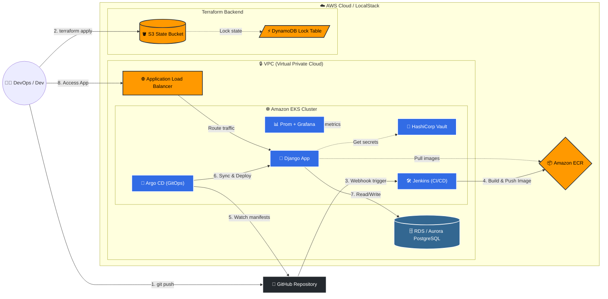

# goit-devops-hw-fp

***Технiчний опис завдань***

# **Фінальне завдання: Розгортання інфраструктури DevOps на AWS**

## **Опис завдання:**

### Основна мета фінального проекту:

*На основі виконаних домашніх завдань з цієї дисципліни, вам необхідно зібрати та розгорнути повну інфраструктуру `DevOps` на `AWS` з використанням `Terraform`, що включає наступні компоненти:*

- Розгортання `Kubernetes` кластера (`EKS`) з підтримкою `CI/CD`
- Інтеграція `Jenkins` для автоматизації збірки та деплою
- Інсталяція `Argo CD` для управління застосунками
- Налаштування бази даних (`RDS` або `Aurora`)
- Організація контейнерного реєстру (`ECR`)
- Моніторинг з `Prometheus` та `Grafana`

### Завдання передбачає наступне:

- Перевірити готовність всіх компонентів на основі створеної інфраструктури
- Зібрати всі модулі `Terraform` та перевірити коректність їх налаштування
- Запустити розгортання за допомогою команди:

   ```bash
   terraform apply
   ```

- Переконатися в доступності основних сервісів через порт-форвардинг
- Продемонструвати роботу `CI/CD` за допомогою `Jenkins` та `Argo CD`
- Перевірити моніторинг за допомогою `Grafana` та `Prometheus`.

### Технічні вимоги

**Інфраструктура:**

- `AWS` з використанням `Terraform`

**Компоненти:**

- `VPC`
- `EKS`
- `RDS`
- `ECR`
- `Jenkins`
- `Argo CD`
- `Prometheus`
- `Grafana`

### **Кроки виконання завдання:**

1. **Підготовка середовища:**
   - Ініціалізувати Terraform
   - Перевірити всі необхідні змінні та параметри

2. **Розгортання інфраструктури:**
   - Виконати команду розгортання:

   ```bash
   terraform apply
   ```

   - Перевірити стан ресурсів через:

   ```sh
   kubectl get all -n jenkins
   kubectl get all -n argocd
   kubectl get all -n monitoring
   ```

3. **Перевірка доступності:**
   - `Jenkins`:

   ```sh
   kubectl port-forward svc/jenkins 8080:8080 -n jenkins
   ```

   - `Argo CD`:

   ```sh
   kubectl port-forward svc/argocd-server 8081:443 -n argocd
   ```

4. **Моніторинг та перевірка метрик:**

   - `Grafana`:

   ```sh
   kubectl port-forward svc/grafana 3000:80 -n monitoring
   ```

   - Перевірити стан метрик в `Grafana Dashboard`

> ⚠️ УВАГА!⚠️
> ⚠️ При роботі з хмарними провайдерами завжди пам'ятайте: невикористані ресурси можуть призвести до значних витрат. Щоб уникнути непередбачуваних рахунків, після перевірки вашого коду обов'язково видаляйте створені ресурси. Використовуйте команду terraform destroy.

> ⚠️ УВАГА! ⚠️
> Пам'ятайте порядок запуску інфраструктури після видалення! При видаленні всієї інфраструктури за допомогою terraform destroy ви також видаляєте S3-бакет і DynamoDB-таблицю, які використовуються для збереження Terraform стейту.

**Структура проекту:**

```md
goit-devops-hw-fp/
│
├── main.tf         # Головний файл для підключення модулів
├── backend.tf      # Налаштування бекенду для стейтів (S3 + DynamoDB)
├── outputs.tf      # Загальні виводи ресурсів
│
├── modules/         # Каталог з усіма модулями
│  ├── s3-backend/     # Модуль для S3 та DynamoDB
│  │  ├── s3.tf      # Створення S3-бакета
│  │  ├── dynamodb.tf   # Створення DynamoDB
│  │  ├── variables.tf   # Змінні для S3
│  │  └── outputs.tf    # Виведення інформації про S3 та DynamoDB
│  │
│  ├── vpc/         # Модуль для VPC
│  │  ├── vpc.tf      # Створення VPC, підмереж, Internet Gateway
│  │  ├── routes.tf    # Налаштування маршрутизації
│  │  ├── variables.tf   # Змінні для VPC
│  │  └── outputs.tf
│  ├── ecr/         # Модуль для ECR
│  │  ├── ecr.tf      # Створення ECR репозиторію
│  │  ├── variables.tf   # Змінні для ECR
│  │  └── outputs.tf    # Виведення URL репозиторію
│  │
│  ├── eks/           # Модуль для Kubernetes кластера
│  │  ├── eks.tf        # Створення кластера
│  │  ├── aws_ebs_csi_driver.tf # Встановлення плагіну csi drive
│  │  ├── variables.tf   # Змінні для EKS
│  │  └── outputs.tf    # Виведення інформації про кластер
│  │
│  ├── rds/         # Модуль для RDS
│  │  ├── rds.tf      # Створення RDS бази даних
│  │  ├── aurora.tf    # Створення aurora кластера бази даних
│  │  ├── shared.tf    # Спільні ресурси
│  │  ├── variables.tf   # Змінні (ресурси, креденшели, values)
│  │  └── outputs.tf
│  │
│  ├── jenkins/       # Модуль для Helm-установки Jenkins
│  │  ├── jenkins.tf    # Helm release для Jenkins
│  │  ├── variables.tf   # Змінні (ресурси, креденшели, values)
│  │  ├── providers.tf   # Оголошення провайдерів
│  │  ├── values.yaml   # Конфігурація jenkins
│  │  └── outputs.tf    # Виводи (URL, пароль адміністратора)
│  │
│  └── argo_cd/       # ✅ Новий модуль для Helm-установки Argo CD
│    ├── jenkins.tf    # Helm release для Jenkins
│    ├── variables.tf   # Змінні (версія чарта, namespace, repo URL тощо)
│    ├── providers.tf   # Kubernetes+Helm. переносимо з модуля jenkins
│    ├── values.yaml   # Кастомна конфігурація Argo CD
│    ├── outputs.tf    # Виводи (hostname, initial admin password)
│       └──charts/         # Helm-чарт для створення app'ів
│       ├── Chart.yaml
│       ├── values.yaml     # Список applications, repositories
│           └── templates/
│           ├── application.yaml
│           └── repository.yaml
├── charts/
│  └── django-app/
│    ├── templates/
│    │  ├── deployment.yaml
│    │  ├── service.yaml
│    │  ├── configmap.yaml
│    │  └── hpa.yaml
│    ├── Chart.yaml
│    └── values.yaml   # ConfigMap зі змінними середовища
└──Django
             ├── app/
             ├── Dockerfile
             ├── Jenkinsfile
             └── docker-compose.yaml
```

**Формат здачі:**

1. Посилання на ваш `GitHub-репозиторій` із гілкою (гілка `final project`)
2. Прикріплені файли репозиторію у форматі `zip` із назвою `final_DevOps_ПІБ`

---

# 🚀 Реалізація проекту (Enterprise Edition)

## 🛠 Prerequisites (Що потрібно для запуску)

Для успішного розгортання цієї інфраструктури на локальному комп'ютері мають бути встановлені наступні інструменти:

### 1. Базове програмне забезпечення

* **Terraform** (>= 1.5.0) — для розгортання інфраструктури (IaC).
* **Terragrunt** — для керування станом (S3 backend) та DRY-архітектури.
* **AWS CLI** — налаштований з вашими `AWS_ACCESS_KEY_ID` та `AWS_SECRET_ACCESS_KEY`.
* **kubectl** та **Helm** (>= 3.0) — для взаємодії з Kubernetes-кластером.
* **Make** — для зручного запуску команд автоматизації.
* **Docker** та **Docker Compose** — (опціонально) для локальної збірки образів.

### 2. Секрети та змінні середовища (`.env`)

Відповідно до практик **DevSecOps**, у цьому репозиторії **відсутні захардкоджені паролі**. Перед запуском необхідно створити файл `.env` у корені проекту (використовуйте `.env.example` як шаблон) та заповнити його вашими секретами:

```env
# Базові налаштування Django
DEBUG=1
DJANGO_SECRET_KEY=super-secret-key-for-dev
ALLOWED_HOSTS=localhost,127.0.0.1,django,0.0.0.0

# LocalStack Pro
LOCALSTACK_AUTH_TOKEN=ls-dOZikUbI-5169-HUYe-TasO-6875bUTAac6e

# Налаштування PostgreSQL (Основна БД)
POSTGRES_DB=django_db
POSTGRES_USER=db_admin
POSTGRES_PASSWORD=strong_password
POSTGRES_HOST=postgres-service
POSTGRES_PORT=5432

# Налаштування MySQL (Для різноманітності, не обов'язково)
MYSQL_ROOT_PASS=root_super_secret
MYSQL_DB=django_mysql_db
MYSQL_USER=mysql_admin
MYSQL_PASS=strong_mysql_password

# Секрети для Terraform (Helm Charts)
TF_VAR_jenkins_admin_username="admin"
TF_VAR_jenkins_admin_password="Super_Jenkins_Password_123!"
TF_VAR_grafana_admin_password="Super_Grafana_Password_123!"

```

*Make-скрипти автоматично підтягнуть ці змінні під час деплою.*

---

## 🚀 Запуск та розгортання

Весь процес розгортання інфраструктури та застосунків керується через утиліту `make`. Щоб побачити повний список доступних команд, їх опис та можливості автоматизації, просто виконайте:

```bash
make help
```

Завдяки глибокій інтеграції обгортки `tf.sh` та `Terragrunt`, процес зведено до однієї команди. Terragrunt автоматично розв'язує проблеми залежностей, створює S3 бакет та DynamoDB таблицю перед початком роботи.

**Для локального розгортання (LocalStack Pro):**

```bash
make deploy-local dev
```

***або якщо щось йде не так... перед тим, як запускати ці команди видаліть контейнери та почистіть все...***

1. Крок: Будуємо фундамент *(VPC + EKS + RDS)*:

***Linux/UNIX/macOS:***

```bash
docker compose up -d localstack && sleep 15 && ./tf.sh tflocal apply -target=module.eks -target=module.rds -var-file=dev.tfvars -auto-approve
```

***Windows (CMD):***

```bash
docker compose up -d localstack && timeout /t 15 /nobreak && .\tf.cmd tflocal apply -target=module.eks -target=module.rds -var-file=dev.tfvars -auto-approve
```

***Windows (PowerShell):***

```bash
docker compose up -d localstack; Start-Sleep -Seconds 15; .\tf.cmd tflocal apply -target=module.eks -target=module.rds -var-file=dev.tfvars -auto-approve
```

2. Крок: Записуємо конфіг кластера *(AWS CLI)*:

***Linux/UNIX/macOS:***

```bash
AWS_ACCESS_KEY_ID=test AWS_SECRET_ACCESS_KEY=test aws --endpoint-url=http://localhost:4566 eks update-kubeconfig --region eu-central-1 --name ironkage-k8s-fp-dev
```

***Windows (CMD):***

```bash
set AWS_ACCESS_KEY_ID=test && set AWS_SECRET_ACCESS_KEY=test && aws --endpoint-url=http://localhost:4566 eks update-kubeconfig --region eu-central-1 --name ironkage-k8s-fp-dev
```

***Windows (PowerShell):***

```bash
$env:AWS_ACCESS_KEY_ID="test"; $env:AWS_SECRET_ACCESS_KEY="test"; aws --endpoint-url=http://localhost:4566 eks update-kubeconfig --region eu-central-1 --name ironkage-k8s-fp-dev
```

3. Крок: Розгортаємо софт *(Jenkins, ArgoCD, Vault, Grafana)*:

```bash
make deploy-local dev
```

**Для бойового розгортання (AWS Cloud):**

```bash
make deploy-aws prod
```

---

> 💡 **РЕМАРКА: Vanilla Terraform Bootstrapping (Шпаргалка)**
>
> проект спроектований так, що автоматизація робить усе самостійно. Проте, якщо виникне потреба розгорнути інфраструктуру, використовуючи **виключно чистий Terraform** (наприклад, для перевірки логіки без Terragrunt), необхідно виконати ручний "бутстрапінг" S3 Backend, щоб уникнути проблеми "курки та яйця":
>
> 1. **Підготовка:** Переконайтеся, що код у файлі `backend.tf` закоментований.
> 2. **Створення бекенду:** Розгорніть тільки ресурси для зберігання стейту (стейт поки збережеться локально):
>
>    ```bash
>    terraform init
>    terraform apply -target=module.s3_backend -var-file=prod.tfvars
>    ```
>
> 3. **Активація віддаленого стейту:** Розкоментуйте код у файлі `backend.tf`.
> 4. **Міграція:** Перенесіть локальний стейт у щойно створений S3 бакет:
>
>    ```bash
>    terraform init -migrate-state
>    ```
>
> 5. **Завершення деплою:** Розгорніть решту інфраструктури:
>
>    ```bash
>    terraform apply -var-file=prod.tfvars
>    ```

---

## 🛰️ Реальна структура проекту

```text
goit-devops-fp/
│
├── main.tf                 # Головний файл для підключення всіх модулів
├── backend.tf              # Конфігурація бекенду (закоментована для LocalStack)
├── variables.tf            # Загальні змінні (вкл. паролі для Jenkins та Grafana)
├── outputs.tf              # Загальні виводи ресурсів
├── dev.tfvars              # Змінні для dev-середовища (LocalStack)
├── prod.tfvars             # Змінні для prod-середовища (AWS)
│
├── Makefile                # ✨ Утиліта для запуску команд (оновлена цілями pf-grafana, pf-vault)
├── terragrunt.hcl          # Конфігурація Terragrunt для автоматичного AWS S3 backend
├── .env.example            # Приклад файлу з секретами
├── .env                    # ✨ Локальний файл із секретами (ігнорується Git)
├── ci.dev.properties       # Конфігурація для CI пайплайнів (dev)
├── ci.prod.properties      # Конфігурація для CI пайплайнів (prod)
│
├── Dockerfile              # Dockerfile для Django застосунку
├── Dockerfile.iac          # Dockerfile для інфраструктурних утиліт
├── Jenkinsfile             # CI/CD пайплайн для Jenkins
│
├── modules/                # Каталог з усіма модулями Terraform
│   ├── vpc/                # Модуль VPC (мережа)
│   │   ├── vpc.tf
│   │   ├── routes.tf
│   │   ├── variables.tf
│   │   └── outputs.tf
│   │
│   ├── eks/                # Модуль Kubernetes кластера
│   │   ├── eks.tf
│   │   ├── aws_ebs_csi_driver.tf
│   │   ├── iam_irsa.tf
│   │   ├── variables.tf
│   │   └── outputs.tf
│   │
│   ├── rds/                # Модуль Баз Даних
│   │   ├── rds.tf          # Фолбек на звичайний RDS
│   │   ├── aurora.tf       # Aurora Serverless v2 для Prod
│   │   ├── shared.tf
│   │   ├── locals.tf
│   │   ├── variables.tf
│   │   └── outputs.tf
│   │
│   ├── ecr/                # Модуль Container Registry
│   │   ├── ecr.tf
│   │   ├── variables.tf
│   │   └── outputs.tf
│   │
│   ├── jenkins/            # Модуль Jenkins
│   │   ├── jenkins.tf      # Helm release (із set_sensitive для пароля)
│   │   ├── variables.tf
│   │   └── values.yaml     # JCasC та налаштування persistence
│   │
│   ├── argo_cd/            # Модуль GitOps (Argo CD)
│   │   ├── argo_cd.tf
│   │   ├── variables.tf
│   │   └── charts/         # Helm-чарт для Argo CD Applications
│   │
│   ├── s3-backend/         # Модуль для S3 та DynamoDB (Вимога ТЗ)
│   │   ├── main.tf         # Створення бакета і таблиці
│   │   ├── variables.tf
│   │   └── outputs.tf
│   │
│   ├── monitoring/         # ✨ Модуль Prometheus & Grafana
│   │   ├── monitoring.tf   # Helm release (kube-prometheus-stack)
│   │   └── variables.tf    # Змінна для grafana_admin_password
│   │
│   └── vault/              # ✨ Модуль HashiCorp Vault (Ваша "крута фіча")
│       ├── vault.tf        # Helm release у dev-режимі з Web UI
│       └── variables.tf
│
├── charts/                 # Helm-чарти вашого застосунку
│   ├── django-app/         # Чарт для розгортання Django в EKS
│   │   ├── Chart.yaml
│   │   ├── values.yaml
│   │   └── templates/      # deployment, service, ingress, hpa, keda тощо
│   └── platform-addons/    # Аддони кластера (наприклад, Karpenter)
│
├── core/                   # Вихідний код вашого Django-застосунку
│   ├── manage.py
│   └── core/               # settings.py, urls.py, wsgi.py тощо
│
├── k8s-addons/             # Додаткові маніфести Kubernetes
│   ├── aws-load-balancer-controller.yaml
│   ├── external-secrets.yaml
│   └── metrics-server.yaml
│
└── Скрипти та утиліти:
    ├── tf.sh, tf.cmd       # Обгортки для запуску Terraform/Terragrunt
    ├── start.sh, start.cmd # Скрипти запуску LocalStack
    └── requirements.txt    # Залежності Python
```

---

## 🏗 Архітектура Інфраструктури

На схемі нижче зображено взаємодію ключових компонентів системи в середовищі AWS (або LocalStack Pro):



---

## 🎯 Висновки (Conclusions)

В рамках цього фінального проекту було розроблено та розгорнуто повноцінну, масштабовану та безпечну DevOps-інфраструктуру. Головним досягненням є створення **гібридної архітектури**, яка дозволяє безболісно перемикатися між локальним середовищем тестування (`LocalStack`) та бойовим хмарним середовищем (`AWS`) з використанням єдиної кодової бази.

**Ключові архітектурні досягнення:**

1. **Гнучкий Infrastructure as Code (IaC):** Використання Terraform у зв'язці з Terragrunt для автоматичної генерації S3 Backend. Код модульний, DRY (Don't Repeat Yourself) та легко масштабується.
2. **Безпека (DevSecOps):** Повна відмова від зберігання чутливих даних у Git. Усі паролі та токени передаються динамічно через змінні оточення (`sensitive = true` в Terraform) та керуються надійними механізмами інтеграції.
3. **Secret Management:** Впроваджено **HashiCorp Vault** (додатковий функціонал рівня Senior) для надійного збереження та керування секретами в рамках Kubernetes-кластера.
4. **GitOps Підхід:** Налаштовано **Argo CD**, який автоматично синхронізує стан кластера з декларативними маніфестами в репозиторії, забезпечуючи концепцію "Single Source of Truth".
5. **Continuous Integration (CI):** Розгорнуто **Jenkins** із персистентним збереженням даних (PVC) та конфігурацією як код (JCasC). Пайплайни готові до автоматизації збірки образів за допомогою Kaniko.
6. **Observability:** Впроваджено повноцінний стек моніторингу на базі `kube-prometheus-stack` (**Prometheus + Grafana**). Метрики кластера, вузлів та застосунків збираються автоматично, забезпечуючи повну прозорість стану системи.

**Результат:** проект повністю відповідає сучасним стандартам індустрії та готовий до обслуговування реальних HighLoad застосунків у Production-середовищі.
